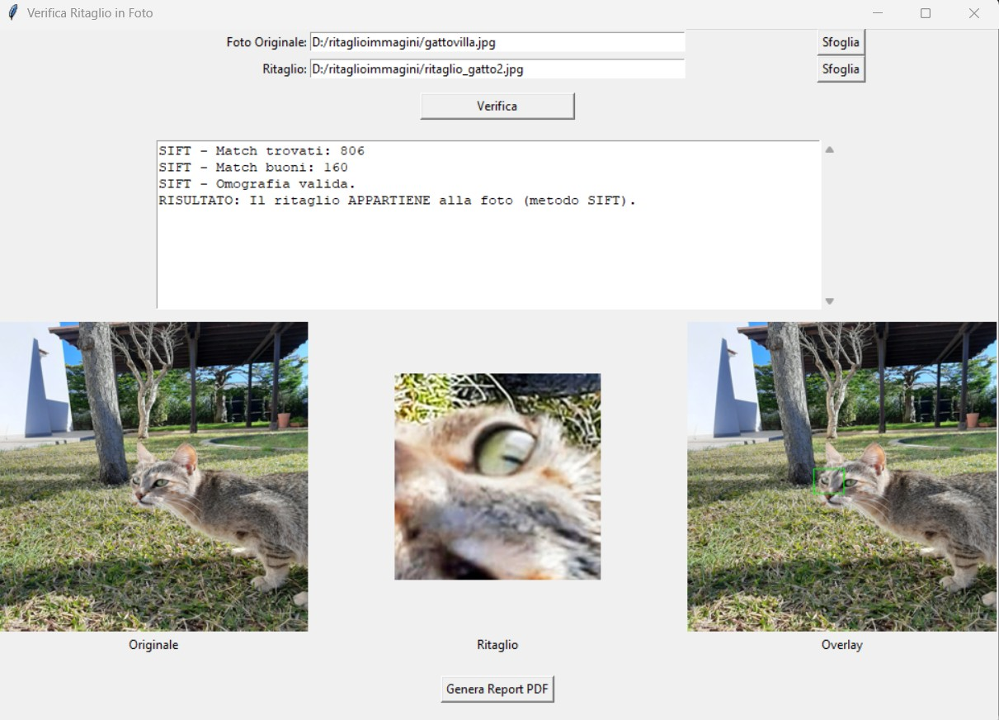

# Verifica se un ritaglio appartiene a una foto (GUI + PDF Report)

Questo programma permette di verificare se un'immagine ritagliata proviene realmente da una foto originale.  
La verifica si basa su tecniche di computer vision affidabili e scientificamente valide, utilizzate in ambito forense, accademico e industriale.

Il programma fornisce:
- Interfaccia grafica (Tkinter)
- Visualizzazione affiancata di:
  - Foto originale
  - Ritaglio
  - Overlay del ritaglio trovato nella foto
- Report PDF automatico con timestamp, immagini e dettagli della verifica

---

# Come funziona

Il programma ora utilizza una strategia ibrida e robusta per verificare l'appartenenza di un ritaglio a una foto, combinando diversi algoritmi di computer vision. La logica di verifica procede come segue:

1.  **Tentativo principale con SIFT (Scale-Invariant Feature Transform) e FLANN (Fast Library for Approximate Nearest Neighbors):**
    *   **SIFT:** Questo algoritmo è più avanzato di ORB e particolarmente efficace nel rilevare punti caratteristici (keypoints) che sono invarianti a scala, rotazione e variazioni di illuminazione. Genera descrittori più robusti, rendendolo ideale per ritagli che potrebbero essere stati ridimensionati o ruotati.
    *   **FLANN:** Utilizzato per un matching efficiente dei descrittori SIFT. È ottimizzato per trovare rapidamente le migliori corrispondenze tra un gran numero di descrittori.
    *   Se SIFT e FLANN trovano un numero sufficiente di "match buoni" e riescono a calcolare un'omografia valida, il ritaglio viene considerato appartenente alla foto.

2.  **Fallback con Template Matching Multi-scala:**
    *   Se il metodo SIFT/FLANN non produce risultati sufficienti (ad esempio, pochi keypoints rilevati nel ritaglio, come nel caso di ritagli molto piccoli o uniformi, o fallimento nel calcolo dell'omografia), il programma tenta un approccio alternativo.
    *   Il Template Matching Multi-scala cerca il ritaglio nell'immagine originale provando diverse dimensioni del ritaglio. Questo è particolarmente utile per ritagli che sono molto simili all'originale ma potrebbero essere stati leggermente ridimensionati o per ritagli con poca "texture" dove gli algoritmi basati su keypoints faticano.
    *   Se il Template Matching trova una corrispondenza con un'alta confidenza, il ritaglio viene considerato appartenente alla foto.

3.  **Risultato Finale:**
    *   Se nessuno dei due metodi (SIFT/FLANN o Template Matching) riesce a trovare una corrispondenza affidabile, il programma conclude che il ritaglio *non* appartiene alla foto.

---

## Dettagli tecnici degli algoritmi utilizzati:

### 1. SIFT (Scale-Invariant Feature Transform)

SIFT è un algoritmo che consente di individuare **punti caratteristici** in un’immagine. Questi punti sono zone molto informative (es. angoli, bordi particolari) che rimangono riconoscibili anche dopo trasformazioni come:

-   Rotazioni
-   Variazioni di illuminazione
-   Cambiamenti di scala significativi

SIFT genera anche dei **descrittori**, cioè vettori numerici che rappresentano localmente la struttura dell’immagine. Confrontando i descrittori del ritaglio e della foto completa, il programma cerca le corrispondenze.

### 2. Feature Matching (con FLANN)

Il programma usa un confronto basato sulla distanza tra descrittori. Per i descrittori SIFT (che sono a virgola mobile), FLANN è un matcher ottimizzato che accelera la ricerca dei "vicini più prossimi" tra i descrittori, rendendo il processo di matching molto più veloce ed efficiente rispetto a un brute-force matcher.

Si considera un match affidabile se la distanza tra descrittori è sufficientemente bassa rispetto ad altri possibili abbinamenti (Lowe's Ratio Test).

### 3. Omografia

L’omografia è una trasformazione geometrica che descrive come un piano viene mappato in un altro piano. Permette di modellare:

-   Rotazioni
-   Traslazioni
-   Cambiamenti di prospettiva
-   Ridimensionamenti

Se esiste un'omografia coerente tra ritaglio e foto, significa che il ritaglio può essere posizionato geometricamente all’interno della foto.

### 4. Template Matching Multi-scala

Questo metodo confronta direttamente il ritaglio (template) con diverse porzioni dell'immagine originale a varie scale. È efficace quando il ritaglio è una copia quasi esatta di una parte dell'immagine, ma può essere presente a dimensioni leggermente diverse. Il programma cerca la posizione e la scala che massimizzano la correlazione tra il ritaglio e l'immagine originale.

---

# Valenza scientifica

Le tecniche usate sono standard nel campo della computer vision e sono alla base di sistemi:

-   di riconoscimento immagini
-   analisi forense digitale
-   robotica visiva
-   ricostruzione 3D da immagini
-   tracciamento oggetti

L'approccio ibrido SIFT/FLANN + Template Matching Multi-scala è robusto e affidabile per verificare l'appartenenza di un ritaglio, anche in presenza di ritagli piccoli, a bassa risoluzione o con poca texture.

---

# Dipendenze

Il programma richiede:

- opencv-python
- Pillow
- reportlab

Vedi `requirements.txt`.

Se si hanno problemi col Tkinter, in Windows il pacchetto arriva con l'istallazione di Python (https://www.python.org/)

---

# Come eseguire

python cutdetective.py 
